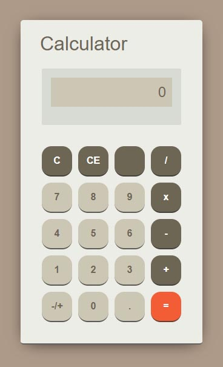

#JavaScript Calculator

JavaScript calculator with Jasmine Unit Tests to make sure calculations are performed correctly. This calculator uses immediate execution logic.

live demo: http://frail-pen.surge.sh/

### Getting the code set up on your computer
1. Firstly you will need to clone this repository by running `git clone https://github.com/sebam2k4/Calculator-JS-Jasmine` command in your terminal.
2. open index.html to start the calculator in your browser
3. open /jasmine/SpecRunner.html to run Jasmine tests
4. modify any way you want.
5. Enjoy!

### To Do:
- add unit tests for input and output
- Add Much Wow! ;)
